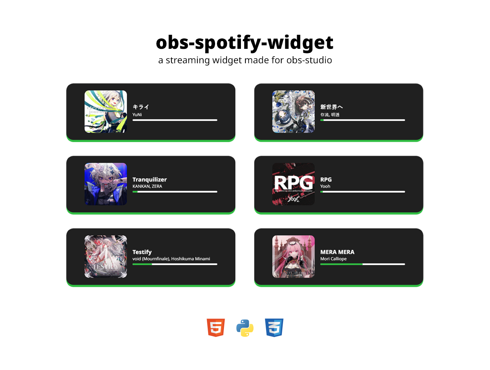

<div align="center">



</div>

## About

This project was hastely made to prettify my Twitch streams, the source
code is not at my best. If I plan to extend this project, I might make
this into an app that all streamers can easily download and use.

## How to use

Create a browser source and input these values
```
URL: http://localhost:5000/song
Width: 600
Height: 202
```
